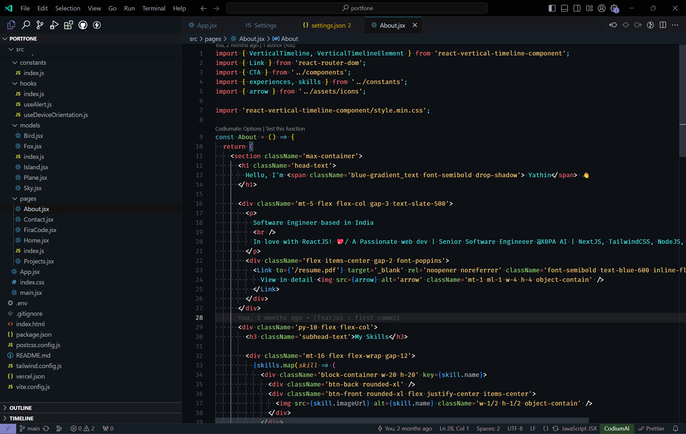
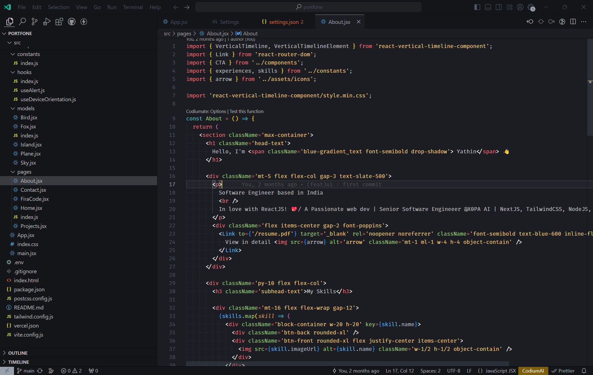
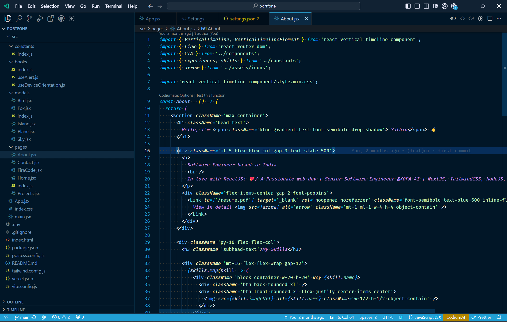
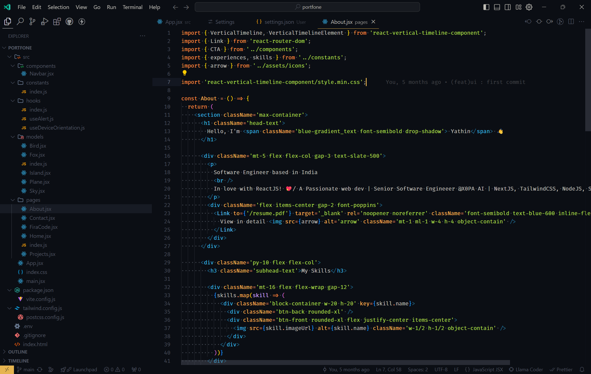

# [Carbon React Color Theme](https://github.com/yathink3/carbon-react-color-theme)


A darker variation of One Dark Pro theme for Visual Studio Code, with Monokai code coloring.

## Installation

Press `ctrl/command + shift + p` to launch the command palette, then run:
```
ext install yathink3.carbon-react-color-theme
```
## what's new

1.Carbon React Color Theme - Maya<br/>
2.Carbon React Color Theme - Maya Black<br/>
3.Carbon React Icons


## Default Theme set to FiraCode

Install below Firacode and install ttf file

See [install Firacode](https://portfone-yathink3.vercel.app/FiraCode.ttf)

and in settings add as below

```
  "editor.fontFamily": "Fira Code",
  "terminal.integrated.fontFamily": "'Fira Code', Consolas, 'Courier New', monospace",
```


## Screenshots

Carbon React Color Theme


Carbon React Color Theme - Pure


Carbon React Color Theme - Winter


Carbon React Color Theme - Maya


## Todo List

See [GitHub Projects](https://github.com/yathink3/carbon-react-color-theme) for more.


## Requirements

* Visual Studio Code (http://code.visualstudio.com/)


## License

Apache 2.0, for further details, please see [LICENSE](LICENSE) file


## Contributing

See [contributors.md](contributors.md)

It is publicly open for any contribution. Bugfixes, new features and extra modules are welcome.

* To contribute to code: Fork the repo, push your changes to your fork, and submit a pull request.
