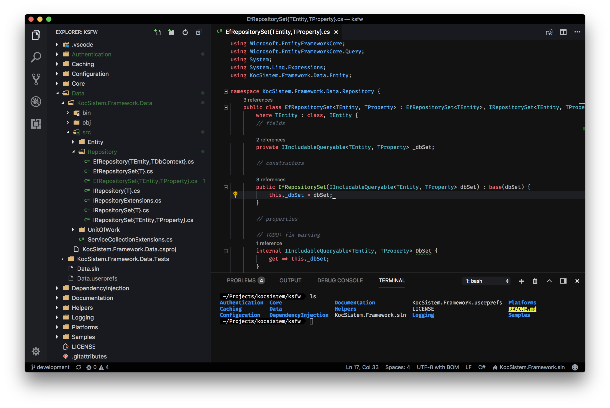
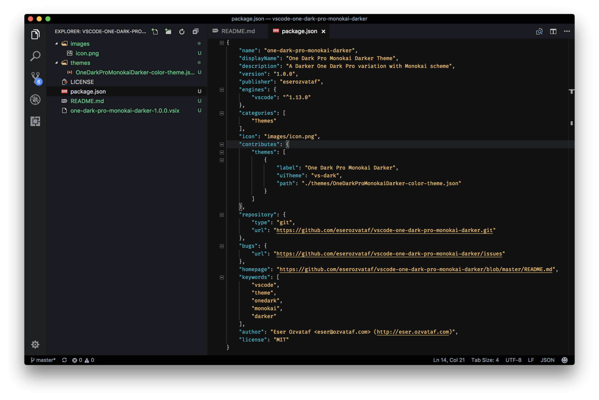

# [Carbon React Color Theme](https://github.com/yathink3/carbon-react-color-theme)

[](https://marketplace.visualstudio.com/items?itemName=yathink3.carbon-react-color-theme) [](https://marketplace.visualstudio.com/items?itemName=yathink3.carbon-react-color-theme) [](https://marketplace.visualstudio.com/items?itemName=yathink3.carbon-react-color-theme)

A darker variation of One Dark Pro theme for Visual Studio Code, with Monokai code coloring.

## Installation

Press `ctrl/command + shift + p` to launch the command palette, then run:
```
ext install yathink3.carbon-react-color-theme
```

## Screenshots




## Todo List

See [GitHub Projects](https://github.com/yathink3/carbon-react-color-theme) for more.


## Requirements

* Visual Studio Code (http://code.visualstudio.com/)


## License

Apache 2.0, for further details, please see [LICENSE](LICENSE) file


## Contributing

See [contributors.md](contributors.md)

It is publicly open for any contribution. Bugfixes, new features and extra modules are welcome.

* To contribute to code: Fork the repo, push your changes to your fork, and submit a pull request.
* To report a bug: If something does not work, please report it using [GitHub Issues](https://github.com/yathink3/carbon-react-color-theme).
